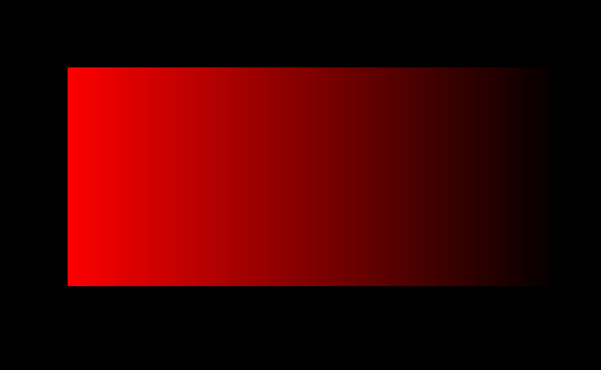

<!-- README.md is generated from README.Rmd. Please edit that file -->

# fifty

<!-- badges: start -->

<!-- badges: end -->

The goal of fifty is to justify a very bad twitter joke. Installation:

``` r
remotes::install_github("djnavarro/fifty")
```

The `fifty::shades()` function takes a single colour name as input and
returns a palette generating function that progressively adds
transparency:

``` r
library(fifty)

# two palettes against the default white background
palette_show(fifty::shades("grey"))
```


``` r
palette_show(fifty::shades("red"))
```


``` r

# the same palettes against a dark background
par(bg = "black")
palette_show(fifty::shades("grey"))
```


``` r
palette_show(fifty::shades("red"))
```



To be perfectly honest I cannot think of good use case for this.
